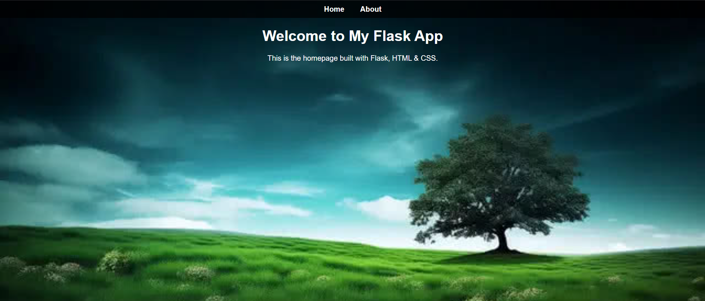
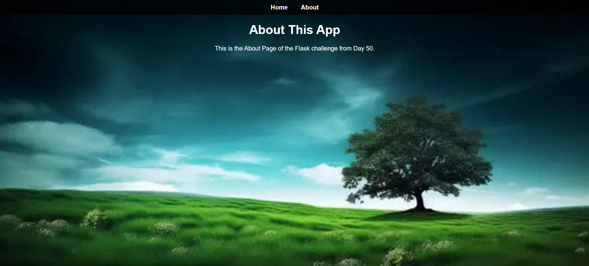

# 📅 Day 50: Create a Flask App

## 🔹 Challenge Overview

Today’s challenge introduces you to **Flask**, a lightweight web framework in Python. You will build a basic multi-page web application with HTML, CSS, and Python using Flask.

---

## ✅ Objective

Build a simple Flask app with the following:

- A **Home Page**
- An **About Page**
- A **Navigation Bar** to switch between pages
- A **Background Image** on all pages

---

## 🛠 Requirements

### 1. Install Flask

Flask does not come bundled with Python. Install it using pip:

```bash
pip install flask
```

> 💡 Tip: Use a virtual environment for clean project management:

```bash
python -m venv venv
source venv/bin/activate  # for Mac/Linux

# OR

venv\Scripts\activate     # for Windows
```

---

### 2. Project Structure

```
/flask_app/
│
├── static/
│   ├── styles.css           # Your CSS file
│   └── background.jpg       # Background image (credit: Hasan Albari from Pexels)
│
├── templates/
│   ├── index.html           # Home page
│   └── about.html           # About page
│
├── app.py                   # Flask app script
└── README.md                # Project readme file
```

---

### 3. Features to Implement

- A clean **navigation bar** on both pages linking to Home and About
- A shared **background image** applied via CSS
- Home page message (e.g., “Welcome to my Flask App!”)
- About page message (e.g., “This is a simple web app built using Flask.”)

---

## 🌐 How to Run

To run the Flask app locally:

```bash
flask run
```

Then visit:

```
http://127.0.0.1:5000/
```

---
## 🖼 Screenshots

### 🏠 Home Page


### ℹ️ About Page



## 💡 Bonus Ideas

- Add some hover effects or animations using CSS
- Make the site mobile responsive
- Add more pages (e.g., Contact, Projects)
- Customize the favicon and title bar

---

## 🧠 What You’ll Learn

- Setting up and running a Flask project
- Serving HTML pages using Flask
- Linking static assets (CSS, images)
- Basic web layout using HTML and CSS

---
